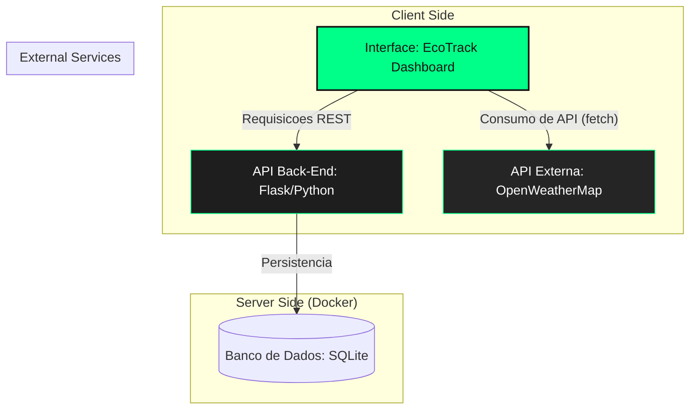

# EcoTrack Pro - Dashboard Industrial (Front-End)

Este repositório contém a interface do sistema **EcoTrack Pro**, um MVP focado na gestão de ativos e monitoramento climático para ambientes industriais.

## 🏗️ Arquitetura do Sistema (Cenário 1.1)

O projeto segue a arquitetura de microsserviços modularizados via Docker, integrando uma API interna e serviços externos de clima.

# EcoTrack Pro - Dashboard Industrial (Front-End)

Este repositório contém a interface do sistema **EcoTrack Pro**, um MVP focado na gestão de ativos e monitoramento climático para ambientes industriais.

## 🏗️ Arquitetura do Sistema (Cenário 1.1)

🚀 Funcionalidades
Monitoramento Climático: Integração em tempo real com a OpenWeatherMap para exibir as condições de Manaus.

Gestão de Ativos: Interface completa para cadastro, alteração de status e exclusão de máquinas.

Feedback Visual: Tags dinâmicas em verde neon e laranja para status operacional e manutenção.

🛠️ Tecnologias
HTML5, CSS3, JavaScript (ES6+).

Docker para containerização.

📦 Como Executar
Certifique-se de que a API Back-End está rodando na porta 5000.

Na raiz deste repositório, execute:

docker build -t ecotrack-front .

docker run -d -p 80:80 --name front-container ecotrack-front

Acesse em: http://localhost

📖 Documentação Interativa
Com o container rodando, acesse a documentação oficial das rotas em:
http://localhost:5000/apidocs
